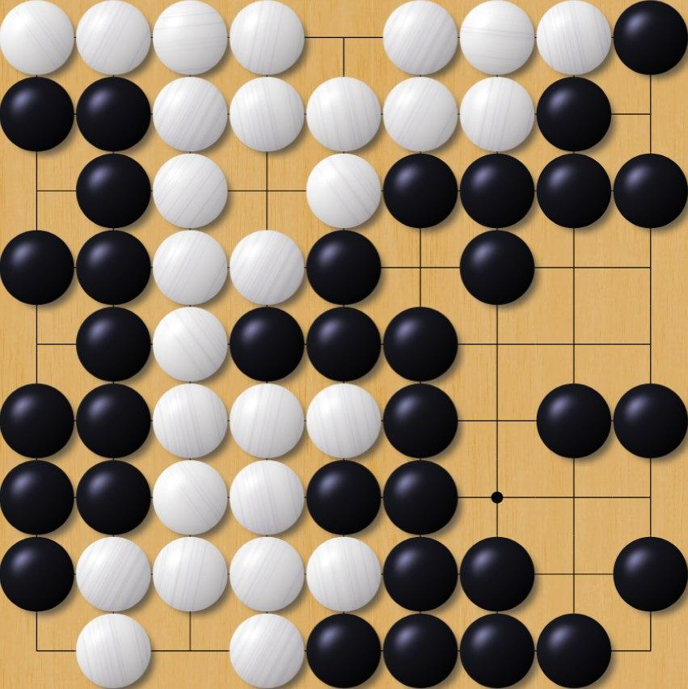
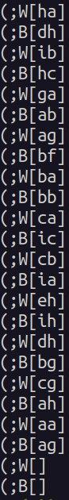
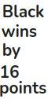

# Go Game Winner Prediction

The meaning of this project follows from the name. The user sends us an image of the endgame position of Go game (Chinese rules), and we tell him who is the loser and winner.
## How it must work

Let's simulate simplified work cycle of the model on the virtual 9x9 Go board (in Japanese - goban) (from left-to-right, top-to-bottom):

Endgame position            | Position recognition
:-------------------------:|:-------------------------:
  |  

Scored endgame           |  Predict winner
:-------------------------:|:-------------------------:
  |  

<em>Photos made during the game on https://online-go.com</em>

1. **Endgame position**: the user sends us a photo of the endgame position. Ideally, it does not matter board is real or virtual, the model must predict both.
2. **Position recognition**: recognize a position in the board with some computer vision (for detecting game board and lines on the board [[1]](#1)) and deep learning algorithms (for classifying what is in the intersection of lines, stone, crossing or empty point). After we find out the position on the photo, we can write it in some convenient format like SGF-format (on photo). Maybe you have a question why you don't use only CNN architectures without classical CV algos. First of all, in my humble opinion, Go game is hard to generalize, it has too many different patterns (<em>remark: Go game has  possible moves</em> [[2]](#2)), therefore to start we must have a too big dataset of labeled games. Secondly, Go game board has highly structured geometry, which's well-suited for algorithmic detection (<em>remark: similar problem - chessboard detection</em> [[3]](#3)). However standard CV algos is badly classifying stones on the board, because it has different glare, size and sometimes structure, so it's time for some SOTA CNN model.
3. **Scored endgame**: after step 2 we have a computer representation of our game. Then we must write an algorithm for scoring two players.
4. **Predict winner**: compare two numbers of the total score and tell who is the winner.

## Datasets
Unlabeled images of Go game:

http://www.oipaz.net/VideoKifu.html

Datasets of Go game in SGF format:

https://senseis.xmp.net/?GoDatabases

If any photos are missing, I can make them on my 13x13 board.

## References

<a id="1">[1]</a> 
Alexander K. Seewald (2009). 
Automatic Extraction of Go Game Positions
from Images: A Multi-Strategical Approach to
Constrained Multi-Object Recognition, 14.

Researchgate link to paper: https://bit.ly/3CSaoRC

<a id="2">[2]</a> 
Christof Koch (2016).
How the Computer Beat the Go Master

Link: https://bit.ly/2ZVca5Y

<a id="3">[3]</a> 
Wikipedia. Chessboard detection

Link: https://bit.ly/3qf6dvG